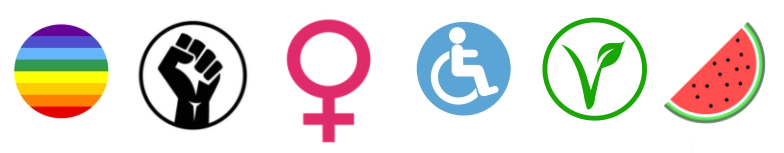

I'm an Associate Professor of Computer Science at the Division of <a href="https://www.kth.se/scs">Software and Computer Systems (SCS)</a> at <a href="https://www.kth.se">KTH Royal Institute of Technology</a> 
in Sweden. I earned my PhD from KTH in 2013, specializing in distributed systems. Following my doctoral studies, I worked as a postdoctoral researcher at the <a href="https://www.ri.se/en">Research Institute of Sweden (RISE)</a>, focusing on data-intensive computing 
platforms. As a postdoc at RISE, I also had the privilege of working as a guest lecturer at <a href="https://ce.aut.ac.ir/index.php?sid=4&slc_lang=en">Amirkabir University of Tehran (AUT)</a> from 2013 until 2015. In 2017, I embarked on a role as a 
machine learning scientist at <a href="https://www.cs.ox.ac.uk/">Oxford University</a>, where I remained until 2018, and subsequently, I returned to KTH as an Assistant Professor of Computer Science. Recently, I initiated the 
<a href="https://co-liberative-computing.github.io/">co-liberative computing</a> research group and started leading the <a href="https://wasp-sweden.org/">WASP</a> "legal, ethical, and societal aspects" cluster. I am also engaged as the specialization representative of SCS in the 
ICT Doctoral program council. My current research centers around the intersection of equity and justice in AI, particularly in the context of large language models. 
 
Our aim at the <a href="https://co-liberative-computing.github.io/">co-liberative computing</a> research group is to promote critical consciousness within the realms of computer science education and research. Acknowledging the inherent lack of 
neutrality in computing and its entanglement with societal oppression, our group places a significant emphasis on developing a keen critical awareness to identify and analyze these pervasive 
inequalities. Our mission revolves around integrating justice and equity as foundational values in computer science research and education. The overarching goal is to ensure that our endeavors 
not only advance technological knowledge but also serve the greater good for all individuals, contributing to a more inclusive and just society. 
 
At the core of our approach is the practice of co-liberation, grounded in the unwavering belief in a collective 'us.' This perspective recognizes the inseparable connection between our individual 
liberation and the imperative to collaborate for mutual freedom and the equitable redistribution of power. In the context of co-liberation, we advocate for a profound commitment to mutual benefit, 
underscoring the collective responsibility shared by both dominant and minoritized groups. Through these principles, we aspire to contribute to a transformative and inclusive computing landscape, 
addressing systemic injustices and fostering a society where technology serves as a force for positive change. This perspective challenges the conventional view of computing services as mere charity, 
reframing them as powerful tools for building meaningful relationships and addressing demographic disparities.

<!------------------------------------------------------------------>
<!-- Start of StatCounter Code for Default Guide -->

<noscript>

</noscript>
<!-- End of StatCounter Code for Default Guide -->

